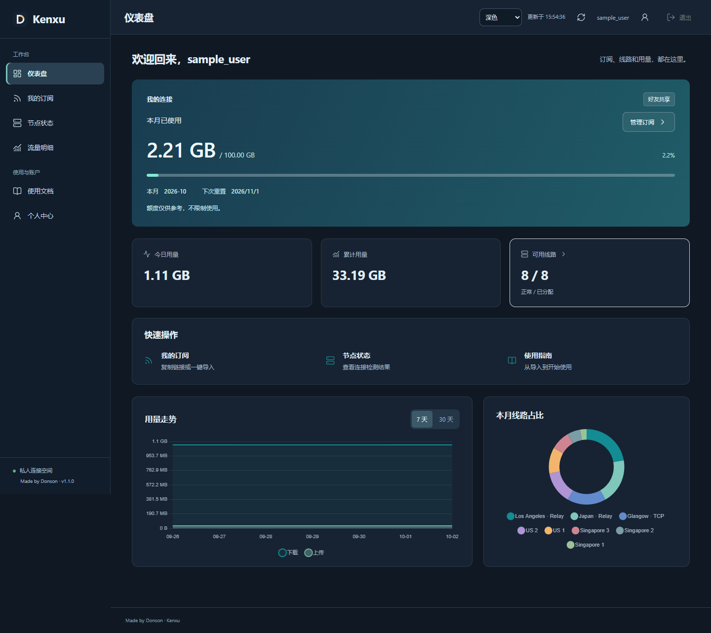
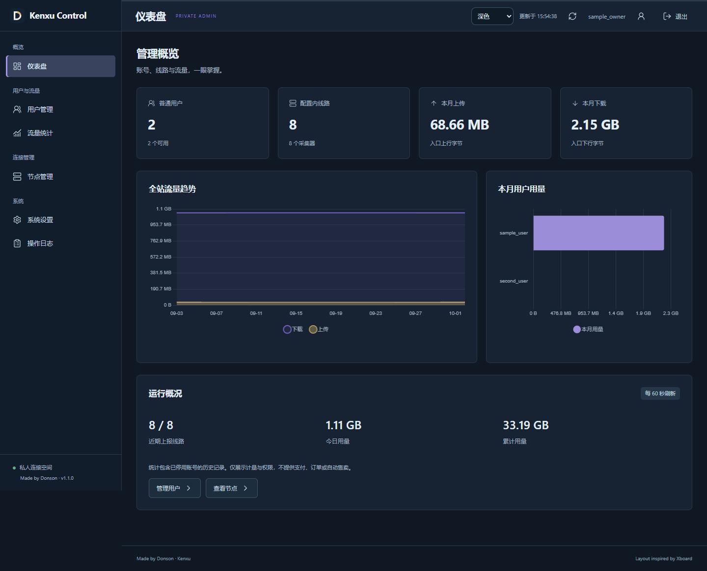

<p align="center"></p>

# Kenxu

面向小范围邀请用户的自托管订阅与流量管理门户。

管理员集中维护线路、分配账号与权限；用户登录后领取自己的配置，查看用量和连接状态。Kenxu 使用 Node.js 与 SQLite，当前部署运行在 Jetson 上，通过 Cloudflare Tunnel 提供 HTTPS 访问，管理后台经私有 SSH 转发访问。

当前代码版本 **1.2.1** · [版本发布](https://github.com/DonsonHH/kenxu/releases) · [使用指南](docs/user-guide.md) · [部署与维护](docs/operations.md) · [问题反馈](https://github.com/DonsonHH/kenxu/issues)

## 界面预览

支持浅色、深色和跟随系统，适配桌面与手机。以下门户截图使用虚构测试账号和用量。

| 用户工作台 | 私有管理后台 |
| --- | --- |
|  |  |

## 提供哪些功能

| 用户端 | 管理端 |
| --- | --- |
| 专属订阅，Clash Verge／Android／Shadowrocket／Stash 导入，下载 YAML | 创建账号、授权线路、重置密码与停用账号 |
| 今日／本月／累计用量，最近 30 天明细 | 按用户和逻辑线路查看上传、下载与历史记录 |
| 用量趋势、线路占比、连接检测结果 | 全站图表、线路用量排行、服务器资源监测 |
| 初始密码修改、订阅链接重置、使用指南 | 用户资料、展示额度、可选有效期、站点设置与操作日志 |

受管线路为每位用户分配独立的 Xray 凭据。即使两个逻辑出口共用一个采集器，也分别记录用量。第三方线路可通过 Jetson 网关转发并计量，用户收到的是网关凭据。

默认展示额度为 **100 GB／月**，用于显示本月使用比例，不实施流量限额或限速。管理员可以修改展示额度；账号停用和有效期属于独立的访问权限设置。项目面向邀请制共享，目前没有公开注册、支付、订单或自动售卖功能。

## 工作方式

门户负责账号、配置分发和用量记录。实际代理连接由 Xray 节点或中转网关处理，线路管理需要配套的采集器。

| 组件 | 职责 |
| --- | --- |
| 用户入口 `127.0.0.1:4450` | 登录、订阅、个人用量与节点状态；通过 Tunnel 发布 |
| 管理入口 `127.0.0.1:4451` | 账号、授权、配置和运维；通过 SSH 转发访问 |
| SQLite 私有数据目录 | 账号、会话、用量、设置、审计与认证限流记录 |
| Xray 采集器 | 同步受管用户凭据，上报累计计数；门户处理重复报告和核心重启 |
| Jetson 连接检测服务 | 定时通过源节点访问检测网站，保存时间、状态与响应耗时 |
| 可选监测适配器 | 从允许的监测站读取 CPU、内存、磁盘、网络与运行时间 |

默认网页查询周期是 60 秒，订阅更新建议为 720 分钟，连接检测周期为 15 分钟。采集器默认每 15 秒采样，具体上报还受队列和网络影响。

## 本地运行

需要 Git、**Node.js ≥ 22.13** 和 pnpm。前端资源由 esbuild 构建，服务端直接运行 JavaScript 模块；SQLite 使用 Node.js 内置模块，无需另装数据库服务。

```sh
git clone https://github.com/DonsonHH/kenxu.git
cd kenxu
pnpm install --frozen-lockfile
pnpm build
```

将 [`.env.example`](.env.example) 复制为 `.env`。Linux／macOS 可用 `cp .env.example .env`，PowerShell 可用 `Copy-Item .env.example .env`。默认配置适合本机验证，数据目录为 `./data`。

在交互终端创建管理员，密码输入不会回显：

```sh
pnpm admin create-admin owner
pnpm admin import /absolute/path/to/private-source.yaml
pnpm start
```

将示例路径替换为自己的 YAML 文件路径。已有管理员时，初始化命令会拒绝覆盖其密码。

服务启动后：

1. 打开 [本机管理入口](http://127.0.0.1:4451)，用刚创建的管理员登录。
2. 创建普通用户并分配线路。
3. 用户打开 [本机用户入口](http://127.0.0.1:4450)，先修改初始密码，再领取订阅。

这几步可以运行门户和配置分发。要获得逐用户流量统计，还需部署采集器并注册受管节点，详见[部署与维护](docs/operations.md)。仅导入 YAML 不会自动完成服务器侧计量接入。

## 配置

| 变量 | 开发默认值 | 说明 |
| --- | --- | --- |
| `NODE_ENV` | `development` | 正式部署设为 `production` |
| `DATA_DIR` | `./data` | 正式部署使用公有资源目录之外的绝对路径 |
| `PUBLIC_ORIGIN` | `http://127.0.0.1:4450` | 用户入口的完整 origin，正式部署使用准确的 HTTPS 域名 |
| `ADMIN_ORIGIN` | `http://127.0.0.1:4451` | 浏览器实际访问的私有管理 origin |
| `PORT` / `ADMIN_PORT` | `4450` / `4451` | 两个服务均绑定回环地址 |
| `MONITOR_ALLOWED_ORIGINS` | 未配置 | 可选监测源的 HTTPS origin 允许列表，逗号分隔 |

站点名称、密码最短长度、会话时长、展示额度和查询周期等选项，可在管理后台的“系统设置”中修改。监测源同时需要填写后台网址并加入服务器允许列表。

正式部署使用现有 Cloudflare Tunnel，将公开域名指向用户端口；管理端保留私有访问。仓库的 [`deploy/`](deploy/) 提供针对当前 Jetson 部署的 systemd 示例，使用前应替换账号、路径、域名和二进制位置。配置步骤、Windows 桌面入口及备份方法见[运维文档](docs/operations.md)。

## 用量与连接状态

- 用量按受管入口的上传与下载合计，月视图采用北京时间自然月；每月重算月视图，累计记录保留。
- Clash Verge 通过订阅响应头读取本月用量；它的卡片通常在更新订阅时才刷新。导入本地 YAML 文件不会自动获取这些响应头。
- 网页的“正常”表示 Jetson 最近一次通过源节点成功访问了检测网站。个人网络和公开中转入口可能有不同结果，客户端测试仍有参考价值。
- 直连、旧共享凭据或绕过受管入口的连接，无法归入某位用户。核心突然退出时，最后尚未上报的字节可能丢失。
- 监测站中的主机网络数据与用户代理用量口径不同，界面分开展示。

电脑、Android、iPhone／iPad 的安装、导入和连接步骤见[用户使用指南](docs/user-guide.md)。订阅页会按设备建议客户端，也可以手动选择。一键导入直接把个人订阅交给已安装的应用，不经过第三方转换网站。Clash Verge 与 Clash Meta 使用原始 YAML；Stash 使用适配的 iOS YAML；Shadowrocket 使用授权 VLESS 节点订阅，不包含 Clash 策略组和规则。

该指南使用当前 Donson 部署的组名，其他部署可以自行替换。导入协议和输出格式已通过自动检查；应用能否在具体手机上打开与完整连接，仍受系统、浏览器和客户端版本影响，页面同时提供复制链接的手动步骤。

## 开发与验证

```sh
pnpm build
pnpm test
pnpm exec playwright install chromium
pnpm test:browser
pnpm audit --prod
```

浏览器检查使用临时数据库和虚构账号，截图写入被 Git 忽略的 `test-output/`。已有 Edge 或 Chrome 时，可将 `PLAYWRIGHT_CHANNEL` 设为 `msedge` 或 `chrome`。例如 PowerShell：

```powershell
$env:PLAYWRIGHT_CHANNEL = 'msedge'
pnpm test:browser
```

刷新行为的复现脚本为 `node test/refresh-performance.mjs`。源码修改后运行 `pnpm build`，再提交相应构建资源。当前检查涵盖账号与权限隔离、认证限流、订阅元数据、月边界、流量去重、删除账号后的旧计数、主题与移动端交互。

```text
src/          服务端、数据存储、计量、连接检测与前端构建入口
public/       页面、可编辑样式、浏览器模块与构建产物
scripts/      构建和连接检测脚本
deploy/       服务单元与私有管理入口示例
test/         后端、浏览器和刷新性能检查
docs/         用户指南、部署维护、版本 review 与界面截图
```

## 安全与维护

用户端与管理端校验不同角色，使用 HttpOnly／SameSite 会话、Origin 与 CSRF 校验。登录限流持久化到数据库，包含账号、来源及总量限制，并约束密码计算并发。当前版本没有 TOTP／WebAuthn。

订阅链接是访问凭据。不要将密码、链接、私有 YAML、SQLite 数据、节点密钥或真实用户截图提交到仓库，也不要对订阅／采集接口启用共享缓存或交互式浏览器验证。静态资源使用校验缓存，敏感响应保留 `no-store`。

升级前备份完整私有数据目录，保留可回退的发布目录。复制数据库前需要停止门户和连接检测等写入者；详细方法与账号删除注意事项见[部署与维护](docs/operations.md)。

## 反馈与贡献

欢迎通过 [Issues](https://github.com/DonsonHH/kenxu/issues) 提交问题和改进建议。描述版本、复现步骤、预期与实际结果，截图及日志请先移除账号凭据。涉及安全问题时，请先联系维护者确认私下报告方式。

提交代码前运行相关检查；界面修改请附桌面和手机效果，协议或计量修改请说明数据兼容性。项目 review 记录见 [1.0.0](docs/release-v1.0.0.md)、[1.1.0](docs/review-v1.1.0.md)、[文档校对](docs/review-docs-20261002.md)、[移动端适配](docs/review-mobile-v1.2.0.md) 和[教程交互优化](docs/review-guide-v1.2.1.md)。

## 致谢与许可

界面信息架构参考 [cedar2025/Xboard](https://github.com/cedar2025/Xboard)，门户使用独立的 Node.js／SQLite 实现。节点部署与采集器相关工作位于 [DonsonHH/my-ansible-playbooks](https://github.com/DonsonHH/my-ansible-playbooks)。项目使用 React、Sonner、Lucide、Chart.js、Express、yaml 和 esbuild。

由 [DonsonHH](https://github.com/DonsonHH) 维护，采用 [MIT License](LICENSE)。第三方库许可见 [THIRD_PARTY_NOTICES.txt](THIRD_PARTY_NOTICES.txt)。
