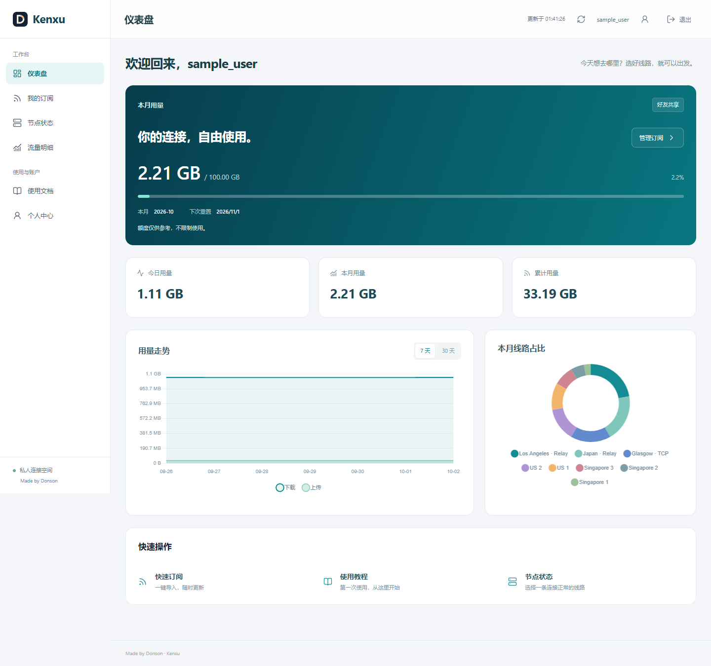
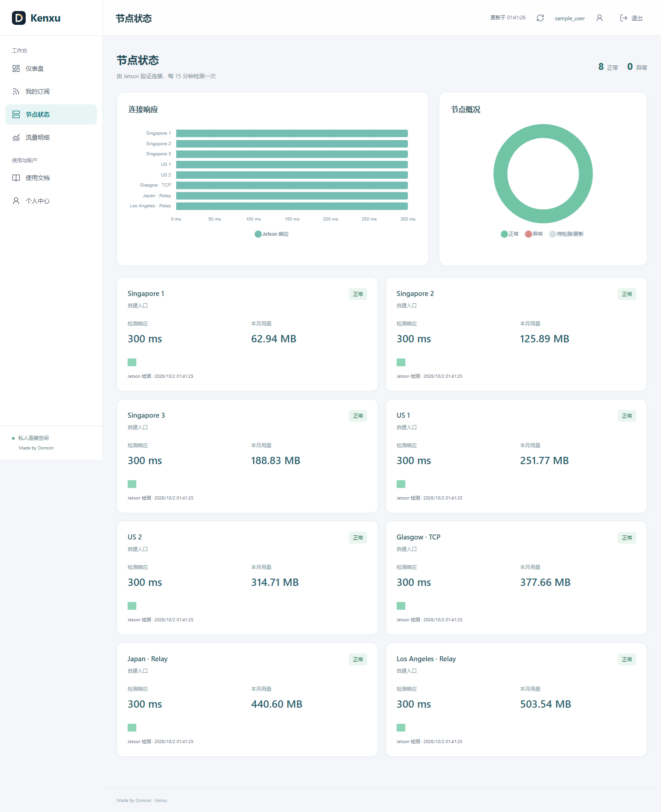
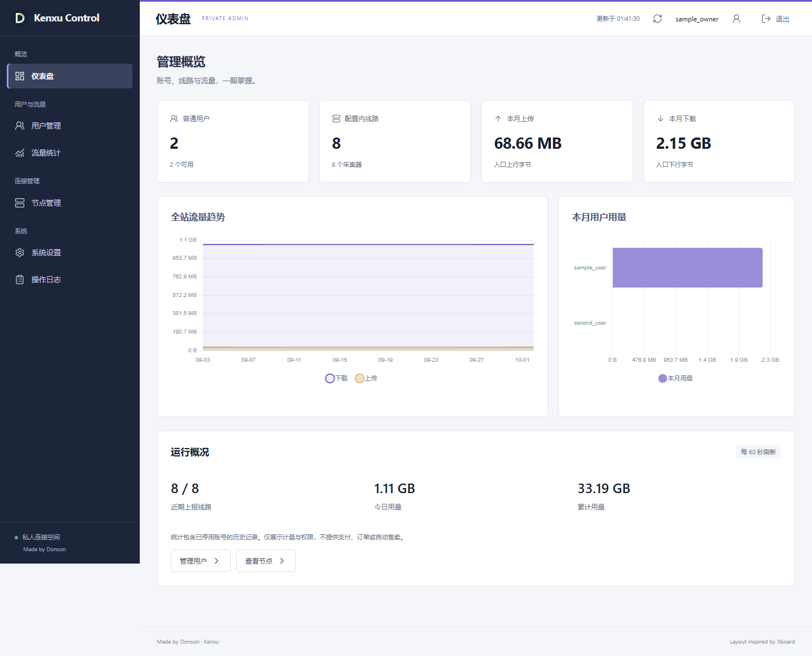
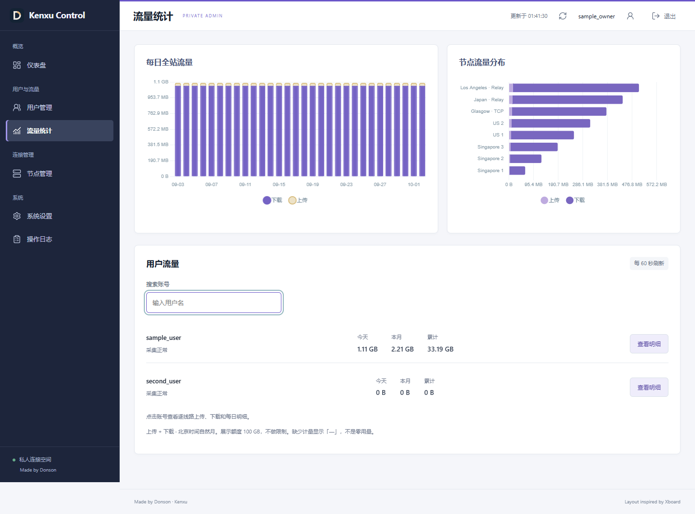
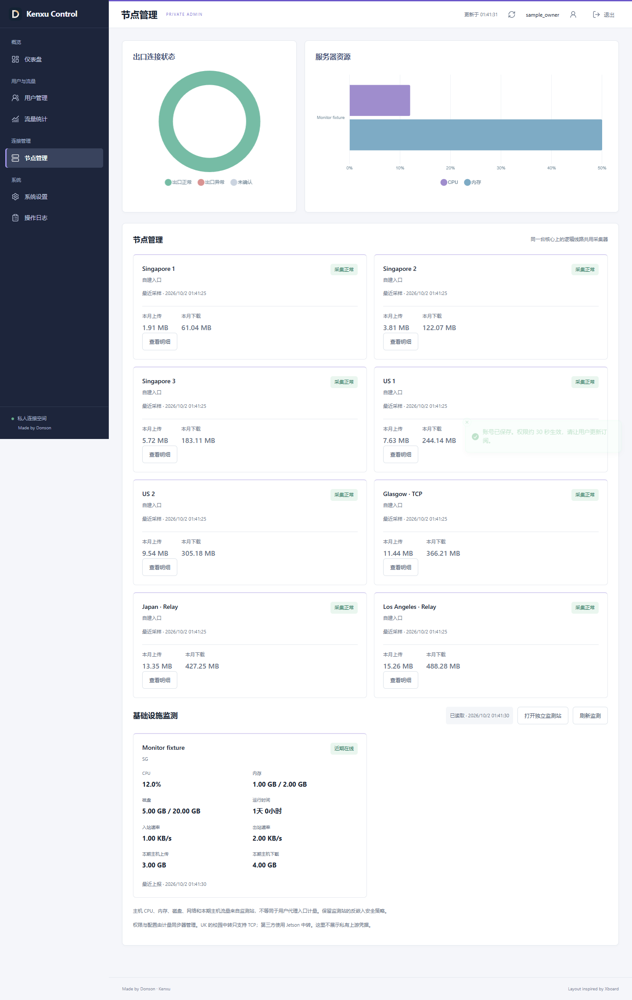
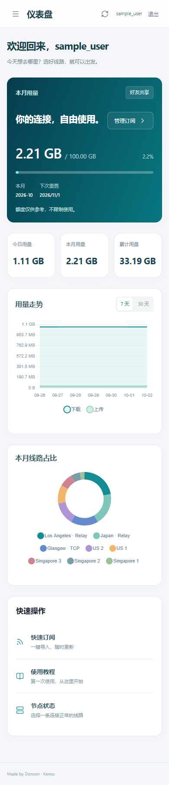
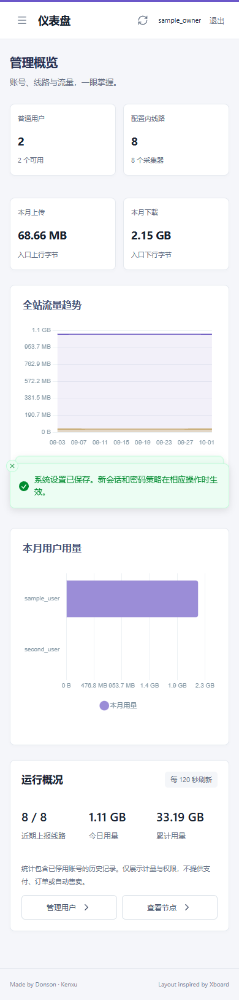

# Kenxu semifinal UI and chart review

The first checkpoint (`0d9bff4`) reviewed the previous administration work and repository, then shipped the distinct user workspace, concise guide and genuine Jetson source-exit checks. This second checkpoint adds role-specific visual summaries without replacing the existing ledger or private administration boundary.

## Design and functionality

| Before | After | Why |
| --- | --- | --- |
| Predominantly numerical user dashboard | Teal 7/30-day trend and monthly route-share chart | Help a friend understand their own usage without management noise |
| Node cards only | User response comparison and normal/failed/unknown overview | Make the cached Jetson connection results easier to scan |
| Daily table only | Stacked upload/download chart plus the original exact table | Show patterns while retaining precise numbers |
| Admin aggregate counters | Violet all-user trend and top-eight user ranking | Distinguish infrastructure management from personal consumption |
| Admin usage list | All-site daily traffic and separate logical-route ranking | Keep UK and SG2 accounting distinct even on one physical collector |
| Admin monitoring cards only | Exit-state summary and CPU/memory comparison | Separate proxy connectivity, counter freshness and host resource state |
| Full-width green strip for one test sample | Up to 24 individual sample positions | Do not make one successful sample look like a full historical window |

The information architecture follows the studied [Xboard reference](https://github.com/cedar2025/Xboard), independently implemented for the existing Node/SQLite portal. The user workspace stays teal and light; the private console retains dark navigation and violet accents. Sonner remains the single toast system. The guide uses direct steps and answers rather than promotional or implementation-heavy copy. No public registration, payment, enforced traffic quota or fabricated historical uptime was added.

## Data and performance review

- Five user charts consume only the user's existing usage response and grant-filtered node checks. Six admin charts consume private admin responses. No extra public telemetry endpoint is introduced.
- Charts preserve upload/download bytes. Logical route totals are not replaced by physical host totals. Monthly route rankings and 30-day daily views are labeled separately.
- The user's 7/30-day control is local and sends no additional request. Website polling remains 60 seconds by default; subscriptions remain 720 minutes. Source exit probes default to 15 minutes, independently of visitors.
- Chart.js is bundled locally with its MIT notice, without a CDN. Only the required controllers/scales are registered. Hidden panels render on demand, identical snapshots reuse instances, and account reload/logout destroys prior chart state. Animation is disabled and raster pixel ratio is capped at two.
- Failed/stale/pending checks are not normal. Unverified latency is omitted, not shown as zero. Offline or stale resource readings are not plotted as current values. Genuine zero traffic gets an explicit empty-usage message, not a fabricated donut segment.
- Canvas charts have data-bearing accessible labels. Exact daily and drilldown tables remain available. This is not a claim of a full WCAG audit.
- Connectivity checks explicitly remove inherited proxy environment variables and disable curl's local configuration. Otherwise a local `NO_PROXY` or curl setting could bypass the selected SOCKS route. Subprocesses are bounded and private temporary files are removed.
- The checker lock rejects incomplete/invalid PIDs conservatively, does not overwrite a live lock, and logs the number actually checked when interrupted. No node secret or raw probe command is logged.

## Verification

Fifteen backend tests and two isolated browser suites pass. Browser assertions cover all eleven charts, 7/30-day changes without extra requests, zero-use display, granted-node API isolation, inaccessible admin telemetry from the user port, logout/account switch, editable profiles/settings, detail dialogs, monthly subscription headers, 60-second refresh, keyboard navigation and 390px layouts for both roles. A previously timing-sensitive polling assertion now pauses the browser clock during setup/screenshots before advancing exactly 59/61 seconds.

The production dependency audit reports no known vulnerabilities. Desktop screenshots and responsive views were visually inspected. All published screenshots contain fictional fixture identities and metrics; they are not evidence of a real friend's usage.

## Captured fixture views

## Deployment boundaries

Releases are staged, private data is backed up with both local database writers stopped, and the current release link is switched atomically. The previous release is retained. User/admin loopback ports, Tunnel routing, restricted desktop SSH forwarding and original provider/source credentials are preserved. Node checker and portal service startup are checked independently after deployment. Live HTTP/static-asset checks are distinct from the fictional authenticated browser tests.

The final staged release also passed all fifteen backend tests on Jetson's Node 22 runtime. After the release switch, portal, checker, meter, relay and Tunnel services were active; portal/checker units remained enabled. The public page and bundled chart returned HTTP 200, the published chart SHA-256 matched the tested local build, and the forwarded administration health endpoint identified itself as private admin. Default policy read back as 60 seconds/720 minutes. The post-restart source-exit cycle completed with eight of eight normal results in about sixteen seconds. These are current probe results, not a promise of permanent availability. The original source YAML hash was unchanged. Homepage, blog and monitoring-site HTTP checks remained successful.

This remains an invitation-only semifinal product, not a fully audited commercial system. A successful Jetson source exit check does not certify a visitor's ISP or the public gateway edge. Counter collection can still lose the final unreported bytes if a core crashes abruptly. Historical ledger data and personal source configuration are not changed by this UI work.
