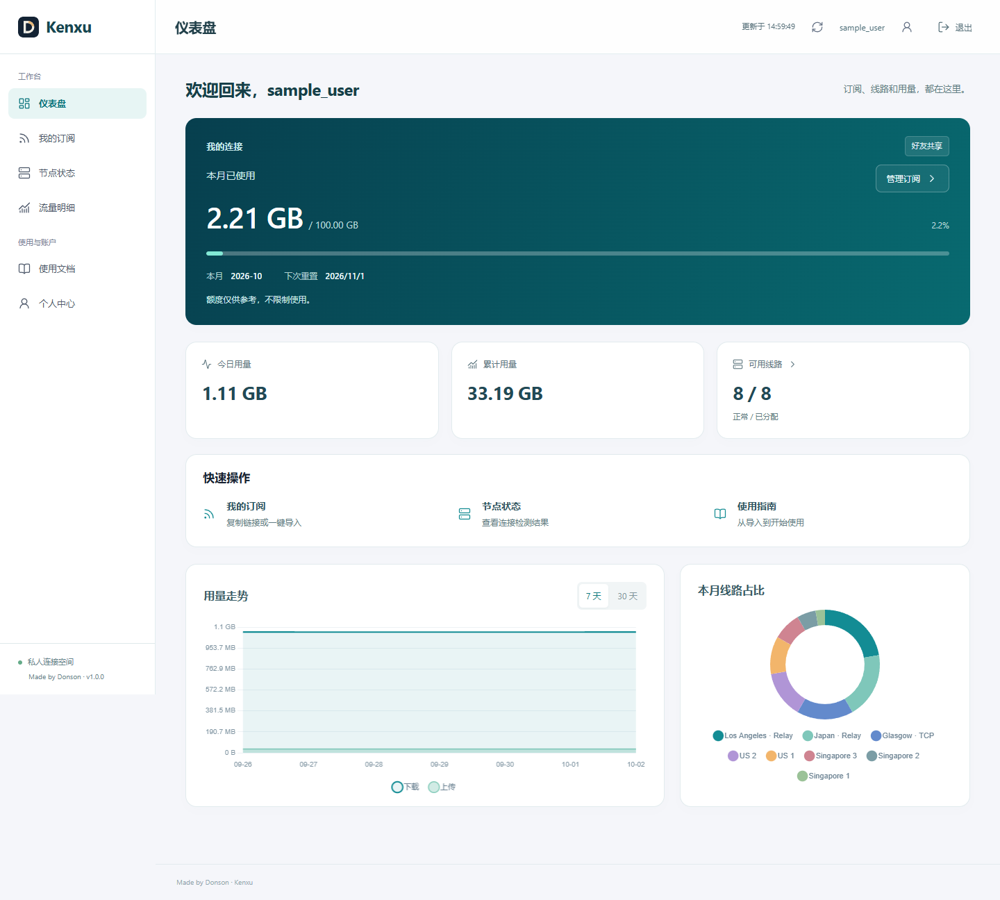
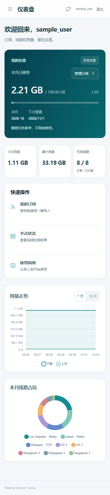

# Kenxu 1.0.0

The first stable release of the invitation-only subscription and usage portal.

## Included

- Separate user and private administrator workspaces.
- Individual subscriptions, first-login password change, and per-user proxy accounting across managed and relayed routes.
- Eleven charts for usage trends, route distribution, connectivity and server resources, with exact detail tables.
- Cached authenticated Jetson connectivity checks, defaulting to fifteen minutes; one-minute website refresh and twelve-hour subscription refresh recommendations.
- A monthly 100 GB display reference without traffic throttling or suspension.
- Editable user profiles and access, private node/user drilldowns, monitoring integration, configurable settings and thirty-day audit retention.
- Responsive navigation, concise usage instructions, and a desktop shortcut for private administration.

## Final polish and fixes

| Before | After | Why |
| --- | --- | --- |
| Duplicate monthly amount in the hero and summary | Available-node summary linking to node status | Use the dashboard space for a different useful fact |
| Subscription actions below charts | Quick actions before trends | Make the frequent task easier to reach |
| Abrupt pointer navigation | Cancellable 160ms panel entry, short button feedback and a 220ms mobile drawer | Acknowledge navigation without delaying interaction |
| Animations also possible after keyboard input | Keyboard actions instant; reduced-motion entry uses opacity only | Respect the input method and motion preference |
| Expired sessions left old content visible | Return to login and clear subscription/chart state | Avoid presenting stale private account information |
| Chart canvas accessible labels retained after logout | Remove all previous data labels and reset the chart range | Clear both visible and assistive-technology content |
| Repeated identical toast messages stacked | Stable message IDs, two visible notifications and bounded durations | Keep feedback readable without duplicate piles |
| Old Xray counters from deleted test accounts blocked complete collector batches | Retain exact per-agent retirement markers and ignore only those deleted identities | Let queued and future reports for active friends continue without recreating test usage |

The final layout uses the existing teal user identity and violet administrator identity. Motion uses the browser's Web Animations API and CSS, with no new animation dependency. Polling and graph data updates do not start entrance animations. The existing single Sonner Toaster remains mounted at the root.

## Review and verification

The preceding GitHub main revision matched the deployed semifinal before changes began. Existing backend tests and the dependency audit passed. Final verification passed sixteen backend tests and both isolated browser suites, including user/admin role isolation, chart range changes, expired-session cleanup, logout, forced password change, mobile navigation, reduced motion and keyboard navigation. Screenshots contain fictional fixture data only.

The four explicitly identified inactive ordinary test accounts are removed from the live deployment after a stopped-writer backup, including their test-only usage records. Three requested ordinary accounts are created with independent generated initial passwords and forced first-login changes. Existing accounts, their usage and source configuration are retained. Initial passwords and production account inventories are delivered privately and are excluded from the repository and release.

Live collector review caught a deletion edge case: Xray can keep reporting counters for removed clients. Without an identity retirement marker, one removed identity rejects the whole report and stalls the durable queue. The regression reproduces that failure, then verifies active-user accounting, duplicate handling, rejection of genuinely unknown or wrong-agent identities, and the absence of recreated deleted usage. Retirement markers contain identity identifiers, not proxy UUIDs or login credentials. They must be recorded before administrative account deletion.

After deployment, all eight logical routes had current collector reports (one to ten seconds old) with matching desired revisions, and all eight Jetson source checks were normal. The three new accounts passed actual public login checks and remained in forced-password-change state with subscription delivery locked until that step. The live health endpoint returned version `1.0.0`. Published script/style hashes matched the reviewed local build; the origin HTML matched too. Cloudflare appends its existing analytics script to edge HTML, so whole-file HTML equality is checked at the origin rather than falsely claimed at the edge.

Publication uses the versioned `v1.0.0` tag and GitHub Release after the staged deployment and live version/health checks. This release targets a small trusted invitation-only group. A successful Jetson source check describes that source path at the recorded time; client networks and the public relay edge have separate failure modes. Accounting retains the previous collector behavior, including the possibility of losing unreported final bytes on an abrupt core crash.

