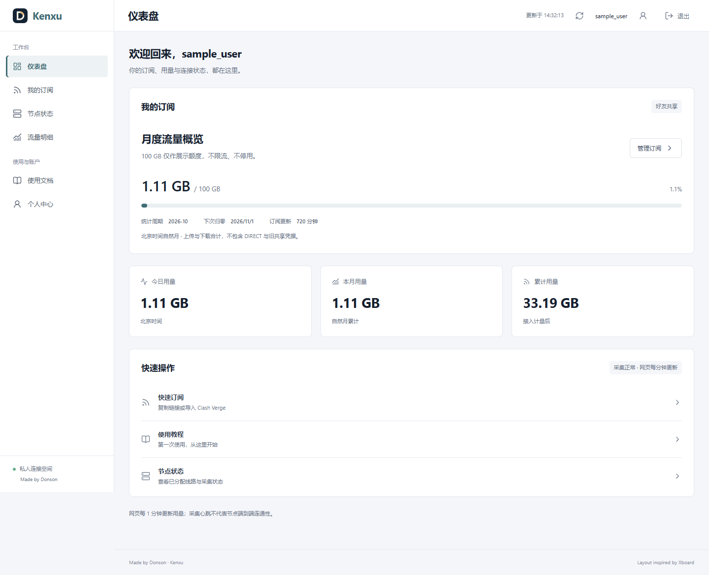
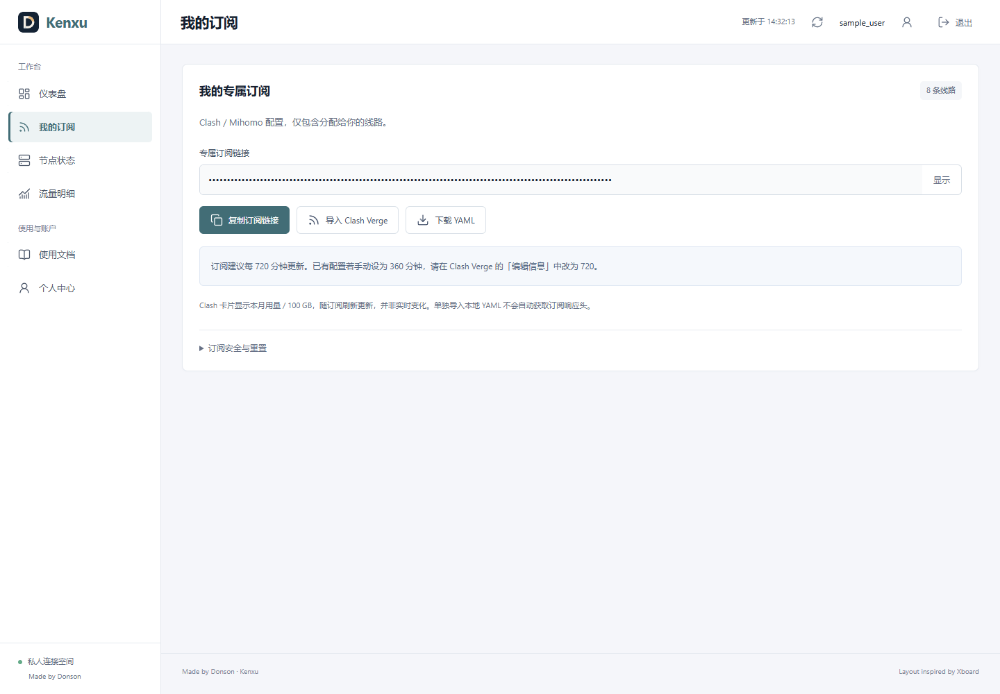
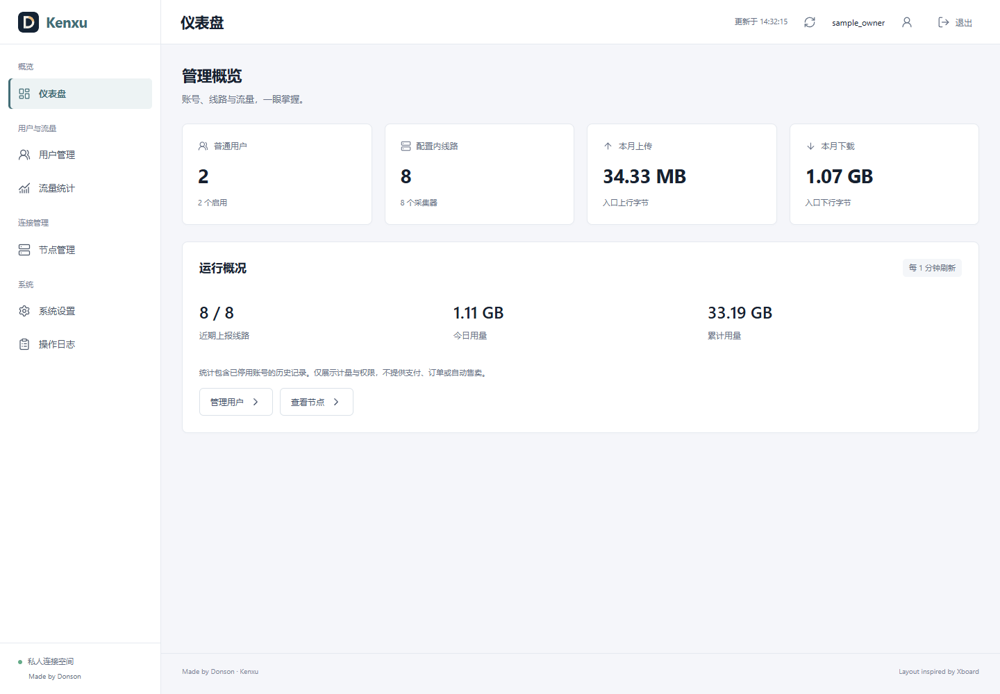
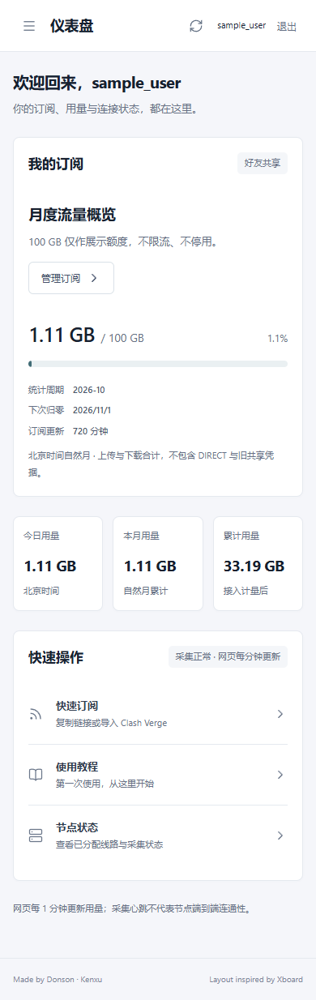

# Subscription metadata and Xboard UI review

## Before implementation

The existing account/CSRF/subscription, per-user ledger, relay isolation and browser lifecycle checks passed. The live portal and two local Jetson services were active, and eight logical routes had recent reports. This refresh did not alter VPS cores, provider credentials, the campus session, existing accounts or the original private source file.

The initial current-run screenshot audit found the former all-in-one overview mixed subscription delivery, instructions and statistics, lacked a distinct personal center, and did not expose monthly allowance or usage history. Source review found stale README statements denying traffic forwarding/accounting, redundant route queries without a user/node index, and incomplete logout clearing of numeric fields.

## Implemented and repaired

- Subscription recommendation changed from 6 to 12 hours (720 minutes). Website usage polling changed from 15 to 60 seconds, including visibility-event throttling. Node sampling remains 15 seconds to retain accounting accuracy.
- Monthly per-user upload/download and a non-enforcing 100 × 1024³-byte allowance added to GET/HEAD subscription responses; no fake expiry, transfer limiter or automatic suspension.
- Monthly period uses Beijing calendar boundaries, including the upper month boundary. The lifetime ledger is retained.
- Xboard-style sidebar/top bar and separate user/admin views, including real history, search, account controls and safe subscription delivery. Payment/order screens are not fabricated.
- Mobile drawer focus, Escape behavior and reduced-motion support; a viewport-transition screenshot exposed a side-panel remnant which was repaired.
- Logout/account switching clears prior subscription links, usage values, node lists and identity fields. Late usage responses are scoped to the initiating account object.
- Concurrent automatic/manual refreshes share a request, and failed shared requests propagate correctly to manual error feedback instead of a false success toast.
- Registration-disable fault injection reproduced an unsafe fallback to source/provider credentials. Disabled managed routes and unenrolled managed gateways are now removed from delivered configurations, not replaced by their raw upstreams. A regression test guards this path.
- Private operating helpers/registration files are excluded from Git. The MIT license already in the target repository is preserved, and bundled-library notices are included.

## Captured flow audit

All published screenshots below are from isolated fictional accounts in the current run. No production credentials or real friend details are pictured.

1. **Sign-in and initial password change — healthy.** Account lifecycle checks cover initial password enforcement, relogin and download isolation. Native-client import is not automatically clicked during tests.
2. **Dashboard — healthy.** Monthly allowance, period/reset date, totals and shortcuts have a clear order. The progress bar is a display reference, not a restriction.

   

3. **Subscription — healthy.** Links remain masked, copy/download/import actions are distinct, and the existing-client 720-minute override is explained.

   

4. **Private administration — healthy.** Dashboard, account search/filtering, traffic, nodes, system settings and audit log are separately navigable.

   

5. **Mobile navigation — healthy after repair.** At 390px, the closed sidebar is fully offscreen, the menu traps focus while open, Escape closes it, and no horizontal overflow occurs.

   

Screenshots establish visual state only. Interaction, keyboard, request timing, authentication and quota behavior are separately verified by automated tests. They do not establish complete WCAG compliance or the current uptime of third-party exits. The in-app browser was unavailable; the user authorized an isolated Playwright browser as the capture fallback.

## Test gates

Eight Node tests and two isolated browser suites passed. Coverage includes Beijing rollover, other-user isolation, exceeding 100 GB without suspension, duplicate counters/restart history, disabled-gateway fallback protection, CSRF/roles, source filtering, fixed-path WebSocket forwarding, all 12 user/admin sections, 60-second timing and 390px navigation. Production dependency audit reported no known vulnerabilities at review time.

Clash Verge metadata compatibility is established against the project's primary parser and actual response-header tests. The native application card is refreshed on subscription update, so it is not a real-time minute-by-minute traffic widget. A previously saved 360-minute client option takes precedence over the provider recommendation and needs one manual change to 720.

Stage/rollback procedure retains the prior release and a stopped-service private-data backup. No private databases, HMAC keys, source YAML, collector tokens, Tailscale host addresses or private configuration screenshots are published.

## Live deployment verification

The published subscription HEAD response returned HTTP 200, `profile-update-interval: 12`, the correct current-user monthly counters and `total=107374182400`, with no invented expiry and `Cache-Control: no-store, private`. Portal, homepage, blog and monitor endpoints all returned HTTP 200 after the release switch. Jetson's portal, relay and collector services remained active; existing node/account registrations were preserved. The private header-probe artifact was temporary and is excluded from version control.
