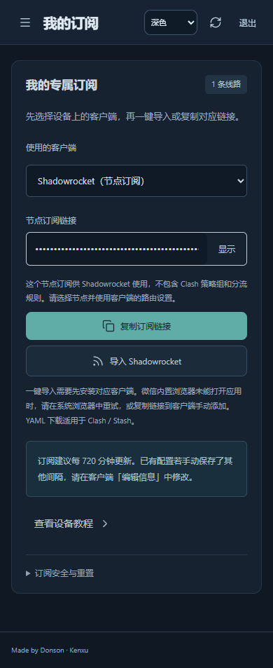

# 1.2.0 移动端教程与订阅适配 review

## 来源与范围

本轮开始时，本地与 GitHub main 同为 `1053c93`，Jetson 运行 `1.1.1`。门户、节点检测、计量与 Tunnel 服务正常，八条线路的检测及报告更新正常。

用户提供的十页 PDF 完整提取了文本，重点查看并渲染前两页的“走向世界”教程。内容按本站账号与客户端流程重新编写：个人订阅取代旧的共享配置，Android 的更新建议从原文 1440 分钟调整为本站默认 720 分钟，macOS 安装说明区分 Apple Silicon 与 Intel。正文没有发布原文中的网盘密码、共享订阅地址或其他服务账号信息。原始 PDF 保留在用户本机，不作为公开网站下载文件。

## 改动

| 修改前 | 修改后 | 原因 |
| --- | --- | --- |
| 仅有电脑客户端入门说明 | 电脑／Android／iPhone与iPad 教程切换 | 按设备提供安装、导入、启动与排查步骤 |
| 单一 Clash Verge 导入链接 | 客户端选择器与对应 URL Scheme | 避免把同一链接格式不加说明地交给所有应用 |
| 导出仅提供通用 Clash YAML | Shadowrocket 节点订阅和 Stash iOS YAML | 适配不同客户端的配置与规则模型 |
| 手机用户不清楚 VPN 授权步骤 | 说明选中配置、允许系统 VPN 请求和测试目标网站 | 区分导入配置与建立连接 |
| 浏览器未唤起应用时缺少手机说明 | 提供手动 URL 导入、系统浏览器重试和具体应用步骤 | 保留可完成任务的替代操作 |

订阅页按设备建议客户端，用户可以手动改选并记住选择。显示与复制的链接始终对应当前选项；切换后重新隐藏链接。导入反馈由已有单个 Sonner 提供，只说明在应用中确认操作，不宣称浏览器已经完成导入。移动端的输入标签对比度和设备选择按钮也进行了调整。

## 格式与权限

- Clash Verge 和 Clash Meta for Android 使用原始授权 YAML；Android 的 Scheme 使用 `clashmeta://install-config`，并附当前站点更新周期。
- Shadowrocket 使用 `?format=shadowrocket` 返回的 Base64 VLESS URI 列表，保留 Reality／Vision 或 WSS 所需字段。不包含 Clash 策略组和规则，教程明确使用应用自身路由设置。
- Stash 使用 `?format=stash`：保留授权节点、组、域名规则与规则提供器，将 `sticky-sessions` 调整为 `consistent-hashing`，省略电脑进程规则与电脑 DNS 配置，使用 Stash DNS 设置。
- 格式转换以 `store.config(user)` 产生的已授权、已重写网关配置为输入，不直接序列化私有源，也不调用远程转换网站。
- 所有格式复用同一签名订阅凭据和停用／到期／初始改密检查，保留月用量响应头、十二小时更新建议以及 `no-store`。格式变化不会创建新账号、修改节点凭据或改变计量身份。
- Shadowrocket 输出当前支持 VLESS TCP／Reality 和 WebSocket；遇到未支持的协议、链式代理或不能正确表达的 WS 字段，会拒绝输出，避免悄悄丢失关键参数。

参考资料：[Clash Meta for Android 项目](https://github.com/MetaCubeX/ClashMetaForAndroid)、[Shadowrocket 帮助](https://github.com/LOWERTOP/Shadowrocket/wiki)、[VLESS 分享标准](https://github.com/XTLS/Xray-core/discussions/716)、[Stash 导入协议](https://stash.wiki/faq/url-schema)、[Stash 策略组](https://stash.wiki/proxy-protocols/proxy-groups)及[协议说明](https://stash.wiki/proxy-protocols/proxy-types)。应用获取信息链接到官方发布页／App Store；没有固定原文中的历史价格或共享商店账号。

## 验证

后端检查覆盖 URI 参数、中文与国旗标签、IPv6、WS 路径、Stash 策略调整、客户端链接编码、Android／iPad 识别、格式切换、逐用户授权、第三方上游隐藏、响应头、HEAD、未知格式及重置／停用后的失效。

本地 24 项后端检查、两套隔离浏览器流程和生产依赖检查通过。Jetson 的相同模块检查也通过。客户端选择框的标签关联问题在浏览器验收中发现并修正；深色模式下同时提高了标签对比度。

隔离浏览器检查覆盖三个设备教程、四种客户端选择、对应链接格式、退出与过期后的链接清理，以及 390px 手机深色布局。截图使用虚构账号。浏览器不点击测试 URI 以尝试安装或启动本机真实客户端。

验证边界：自动检查与手机尺寸浏览器验证通过，不等于已在真实 Android／iPhone 的原生应用中完成导入和代理连接。浏览器、系统和应用版本可能影响唤起行为，所以教程保留手动添加步骤。正式部署采用新发布目录，备份数据并保留前一版本；发布后核对线上资源及受管账号的导出内容，不打印凭据。

线上健康端点返回 `1.2.0`，公开指南和三个已发布构建文件与本地一致。使用一个已有可领取订阅的受管账号，在服务器回环接口读取了三种格式，均得到八个授权节点；Reality／Vision、网关 WSS 参数与月用量元数据相符，上游凭据未出现在网关节点输出中。验证没有登录或修改该账号，也没有输出订阅链接或节点参数。

部署后的账号、节点凭据及源配置与停机备份一致，八条逻辑线路报告新鲜、已同步，源连接检测正常。管理入口保持私有访问。

