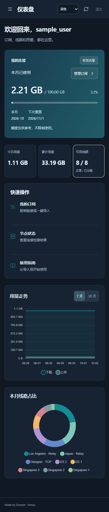

# Kenxu 1.1.0 review

## User experience

| Before | After | Why |
| --- | --- | --- |
| Light user workspace only | Light, dark and system appearance, persisted locally | Make long sessions and evening use comfortable |
| Flat light navigation | Structured dark sidebar, restrained blue/teal surfaces and clearer active state | Give the user workspace the hierarchy of the administration console |
| Toasts and graph labels always light-themed | One theme shared by the document, chart axes and Sonner | Keep controls and feedback readable |
| Copy feedback only in a toast | Temporary copied state on the button as well | Confirm the action near its trigger |
| Previous login screen appeared during session loading | Neutral loading state and parallel session/interface reads | Reduce the login-to-dashboard flash on reload |
| Expired-session cleanup depended on another network request | Clear private UI immediately on expiry, logout and password change | Avoid leaving old private data visible if the network then fails |

Existing cancellable 160ms page transitions, 120ms press feedback and reduced-motion/keyboard behavior remain. Small pointer hover feedback is restricted to precise pointing devices. Data polling does not trigger entrance animation. Dark mode also covers the shared private console, forms, dialogs and notifications.

## Authentication review

The preceding main revision matched the deployed 1.0.0 release. Password hashing, constant-time hash comparison, private admin listener, distinct cookies/roles, CSRF/Origin checks, forced first-password change and revocation behavior were inspected and retained.

The former in-memory limiter reset with the process. Authentication counters now live in SQLite with fixed fifteen-minute windows, hashed scope identifiers, an expiry index and a 4096-key bound. For each realm and operation there are account (8 attempts), source (30) and overall (120) budgets. Successful authentication clears the account budget; source/overall budgets remain. The ninth account attempt is rejected until its current window expires. Password change and administrative password-writing operations are also bounded. Limits do not permanently disable accounts.

User and private-admin budgets are separated. A shared process pool allows at most three simultaneous password jobs, at most two from either realm. Public password floods cannot consume every password-processing slot. Unknown, disabled and wrong-role accounts retain the same generic login error and hashing path. Account state/password hash are rechecked after asynchronous verification before creating a session. Common repeated/sequential passwords are rejected for newly set passwords; existing passwords are not silently changed.

Only the explicitly configured public Cloudflare path, arriving from a loopback peer, may supply `CF-Connecting-IP`. The private listener ignores forwarded IP headers. Arbitrary `X-Forwarded-For` is not trusted. This relies on the deployed loopback-only origin and existing Cloudflare Tunnel; it is not suitable for exposing the origin port directly. Replies include `Retry-After`, and forms show a bounded countdown. Selected failed-attempt events enter the existing audit log without passwords, attempted usernames or raw addresses.

Sources reviewed: [OWASP authentication guidance](https://cheatsheetseries.owasp.org/cheatsheets/Authentication_Cheat_Sheet.html) and [Cloudflare request-header documentation](https://developers.cloudflare.com/fundamentals/reference/http-headers/). These changes protect against repeated online guessing and limit password CPU work; they do not claim a formal security certification or add TOTP/WebAuthn enrollment.

## Refresh investigation and changes

The isolated, reproducible `node test/refresh-performance.mjs --baseline` run showed 124 removed list children across four unchanged refreshes. Changed graph snapshots rebuilt chart instances. Static assets inherited `no-store`, forcing full retransmission; the initial realm/session requests also ran sequentially. A live unauthenticated browser baseline measured 14 static requests, six stylesheet requests and approximately 191 KB of static transfer on both cold navigation and reload. That single network run reached the ready state in 5.43s cold / 4.76s reload; these timings are observations, not stable service guarantees.

Changes:

- Reuse unchanged node/history/day-list DOM. The matching post-change fixture reports **zero** removed list children.
- Reuse graph instances and call `update('none')` on changed values. The same local sample averaged roughly 1.61ms before / 1.14ms after for chart updates. Network latency is not represented by that local microbenchmark.
- Combine styles into one generated `portal.css`; source styles remain editable separately.
- Bundle the front-end controller and its three small module imports into `client.js` to remove dependent script round trips.
- Static JS/CSS/SVG use private revalidation and ETags; unchanged bodies can return 304. HTML, API responses, subscriptions and credentials remain `no-store`.
- Read realm and session concurrently, and remove the sticky-header backdrop blur.

Jetson's existing seven-account, 11,751-event ledger averaged about 57.7ms for a complete admin usage calculation before changes. This did not justify adding a stale accounting cache or changing the ledger. Website polling stays 60 seconds, subscription recommendation stays 720 minutes, and source checks remain 15 minutes by default.

Final live measurement after controller bundling: **8 static requests, 1 stylesheet request and 2.4 KB of static transfer on reload**, versus 14 / 6 / approximately 191 KB in the baseline. The final sample reached ready in 5.85s cold / 4.31s reload; the preceding intermediate build measured 4.78s / 2.93s. This variation confirms that network timing is significant. The robust measured improvements are fewer dependent requests, substantially less retransmission, and eliminated unchanged list reconstruction; a fixed percentage improvement in page-ready time is not claimed.

## Verification and boundaries

Twenty backend tests and both isolated browser suites passed, including persistent limits across reopening the store, account/source spraying, cooldown, shared password budget, an account disabled during asynchronous password verification, trusted-header boundaries, 429 retry hints, private-cache isolation and 304 responses. Browser checks cover dark-mode persistence, system preference, user/admin and mobile rendering, account switching, expired sessions, keyboard navigation and reduced motion. Screenshots use fictional fixture accounts only.

Deployment is staged with a stopped-writer private-data backup and a retained previous release. Production accounts, passwords, grants, traffic ledger and retired-identity markers are not changed. Live verification checks version, static asset integrity, listener privacy, current collector revisions and node-check freshness. Long-distance network/Tunnel latency can still vary; no claim is made that every possible source of perceived stutter has been eliminated.

The deployed public and private listeners both returned version `1.1.0`; all five published controller/theme/chart/notification assets matched the local build hashes. The production account rows and source settings exactly matched the pre-deployment backup, all eighteen retired-identity markers remained, and all eight routes had fresh reports and matching desired revisions. Eight source checks were normal. Ports 4450, 4451 and 4460 remained bound to loopback, and the portal/checker startup units remained enabled. Authentication attack tests used isolated fixture databases, never a real friend's login.

