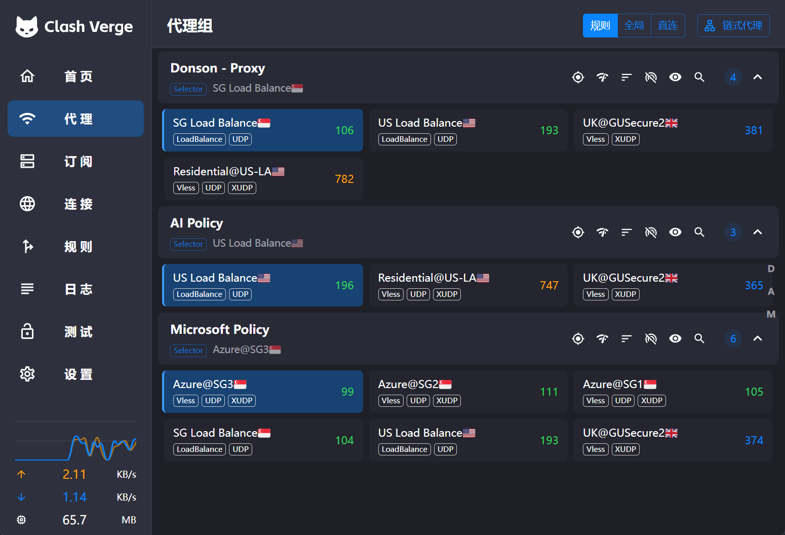

# Kenxu 使用指南

这份“走向世界”指南覆盖电脑、Android 和 iPhone／iPad。节点名称、可选项和延迟可能随账号授权、客户端版本或网络变化。先登录 Kenxu，修改初始密码；之后在“我的订阅”选择已安装的客户端。

## 选择设备和客户端

| 设备 | 客户端 | 本站提供的格式 |
| --- | --- | --- |
| Windows／macOS／Linux | Clash Verge | 授权 YAML、策略组与规则 |
| Android | Clash Meta for Android | 授权 YAML、策略组与规则 |
| iPhone／iPad | Shadowrocket | 授权 VLESS 节点订阅，由应用自己的路由设置分流 |
| iPhone／iPad | Stash | 适配后的 iOS YAML，包含授权节点、组和域名规则 |

订阅页会按设备建议客户端，也可手动切换。选择后显示和复制的链接会对应当前格式，导入按钮会尝试打开对应应用。按钮未打开应用时，按下面的手动步骤操作；微信等内置浏览器中可改用系统浏览器。

## 电脑：从登录到连接

安装包从 [Clash Verge 官方 Releases](https://github.com/clash-verge-rev/clash-verge-rev/releases) 获取。多数 Windows 电脑使用 x64，Apple Silicon Mac 使用 ARM64，Intel Mac 使用 x64；Linux 按发行版和架构选择。文件名和最低系统要求以官方页面为准。

1. 使用管理员提供的账号登录 Kenxu。首次登录先修改初始密码，然后重新登录。
2. 打开“我的订阅”，点击“导入 Clash Verge”。客户端没有弹出时，复制专属链接，在 Clash Verge 左侧“订阅”页面粘贴并导入。
3. 在客户端选中导入的订阅。进入左侧“代理”，右上角保持“规则”模式。
4. 找到 `Donson - Proxy`，日常使用可以先选 `SG Load Balance`；蓝色卡片表示当前选择。
5. 在客户端“首页”或“设置”开启“系统代理”，再用浏览器访问需要的网站。TUN 用于接管不使用系统代理的应用，启用前请阅读客户端说明。

客户端的安装和通用操作可参考 [Clash Verge Rev 快速入门](https://www.clashverge.dev/guide/quickstart.html)。

## Android：Clash Meta for Android

1. 从 [官方 Releases](https://github.com/MetaCubeX/ClashMetaForAndroid/releases) 获取稳定版 APK，常见现代手机一般使用 arm64-v8a。架构不确定时检查设备信息或官方说明。允许浏览器安装此次下载后，可关闭安装授权。
2. 本站“我的订阅”选择 Clash Meta for Android，点击导入并在应用中保存。
3. 手动导入时，复制当前链接，打开应用“配置” → “＋” → “从 URL 导入”。名称填 Kenxu，URL 粘贴完整链接，自动更新可设为 720 分钟，然后保存。
4. 选中这份配置，回到首页点击启动，允许 Android 的 VPN 连接请求。
5. 在代理页面保持规则模式，选择可用节点或组。后台经常断开时可按需允许应用后台运行；不再使用时主动停止连接。

官方支持的导入格式为 `clashmeta://install-config?url=<已编码链接>`，本站直接生成，详见[项目说明](https://github.com/MetaCubeX/ClashMetaForAndroid)。

## iPhone／iPad：Shadowrocket

用自己的 Apple 账号从 [App Store](https://apps.apple.com/app/id932747118) 获取应用，可用地区、价格和系统要求以商店页面为准。用 Safari 打开 Kenxu，再进行导入。

1. 本站“我的订阅”选择 Shadowrocket，点击导入。若未打开，复制当前节点订阅链接。
2. 手动方式：Shadowrocket 首页“＋”，类型选择 `Subscribe`，URL 粘贴完整链接，保存并更新订阅。
3. 从列表选一条线路，开启连接，并按 iOS 提示允许添加 VPN 配置，由你确认设备验证。
4. 访问目标网站判断连接。失败时先更新订阅、测试节点，再切换可用线路。

这个格式包含授权节点与正确的 Reality／Vision 或 WebSocket 参数，不含电脑的 Clash 策略组和分流规则，使用应用自己的路由设置。需要保留本站组名和域名规则时可选择下面的 Stash 方式。操作和 URL Scheme 参考 [Shadowrocket 帮助文档](https://github.com/LOWERTOP/Shadowrocket/wiki)。

## iPhone／iPad：Stash

1. 按 [Stash 官方说明](https://stash.wiki/) 获取支持 VLESS Reality／Vision 的较新版本。
2. 本站“我的订阅”选择 Stash，点击导入；手动方式为复制当前 iOS YAML 链接，在配置管理中从 URL 下载。
3. 选中 Kenxu 配置，保持规则分流、选择策略组，然后连接并允许 iOS VPN 配置。

本站保留授权节点、策略组与域名规则，为兼容 Stash 将负载均衡的 `sticky-sessions` 改为 `consistent-hashing`，省略电脑进程规则和电脑 DNS 配置，使用 Stash 的 DNS 设置。依据是 [Stash 策略组](https://stash.wiki/proxy-protocols/proxy-groups)、[协议说明](https://stash.wiki/proxy-protocols/proxy-types) 和 [导入协议](https://stash.wiki/faq/url-schema)。

## Clash／Stash：代理组怎么选

截图中，主代理组选了新加坡负载均衡，AI 组选了美国负载均衡，Microsoft 组选了 SG3。这三项各自决定命中对应规则的请求，所以只修改主代理组，不会自动改变另外两个组。

| 名称 | 作用 |
| --- | --- |
| `Donson - Proxy` | 一般代理流量的主选择组；有专用策略的站点由对应组决定 |
| `SG Load Balance` | 在已授权的新加坡节点间按策略分配连接 |
| `US Load Balance` | 在已授权的美国节点间按策略分配连接 |
| `AI Policy` | 控制命中 AI 规则的请求；这类网站单独失败时优先检查这里 |
| `Microsoft Policy` | 控制命中 Microsoft 规则的请求；截图中选的是 Azure SG3 |
| `UK@GUSecure2` | 经 SG2 转发到 Glasgow 的线路，本站只支持 TCP |
| `Residential@US-LA` | 单独的美国洛杉矶线路，通过 Jetson 中转计量；名称作为线路标识 |

`Load Balance` 是策略组，不是一台服务器，也不保证合并带宽或自动选取最低延迟。底层组可能默认隐藏；JP 专用组也可能只参与规则分流。负载均衡策略的定义可参考 [Mihomo 文档](https://wiki.metacubex.one/en/config/proxy-groups/load-balance/)。

卡片右侧的数字是客户端连接测试耗时，通常以毫秒显示，越小一般表示这次测试响应越快。它不是下载速度，也不能保证所有网站都能打开。截图里的数值只代表截图当时的结果。

“规则”按配置分流；“全局”和“直连”会改变请求的处理方式。平时保持“规则”，无需额外设置链式代理。

## 更新订阅与查看用量

本站默认建议每 720 分钟（12 小时）更新订阅；管理员调整线路后可以手动更新。已有订阅若保存了其他间隔，可在订阅卡片的“编辑信息”中修改，具体名称以客户端版本为准。

远程订阅会获取新配置，并读取订阅响应头中的本月用量。下载的 YAML 是当时的配置副本，作为本地文件导入后不会自动获取更新或这些用量信息。

网页默认每分钟读取统计，Clash Verge 订阅卡片通常在更新订阅时才刷新。客户端左下角的实时速率和本机累计数字也不是本站账号的本月用量。本站统计受管入口的上传与下载合计，不包含直连。

100 GB 是默认月展示额度，实际以账户卡片为准。超过展示额度不会限流或停用；每月 1 日按北京时间重算月视图，累计记录保留。

## 遇到问题

**已导入但打不开：** 电脑确认订阅已选中、系统代理已开启；手机确认 VPN 已授权并连接。在客户端测试节点后切换可用线路。Clash／Stash 的 AI 或 Microsoft 网站单独失败时调整相应策略组；Shadowrocket 检查自己的路由设置。切换后重新打开网页，必要时关闭目标网站的旧连接再重试。

**网页正常、客户端超时：** 网页的正常结果来自 Jetson 对源节点的定时检测，默认每 15 分钟一次。你的网络以及客户端到公开中转入口的路径可能不同，请同时参考客户端测试和实际访问。

**登录尝试过多：** 按页面倒计时等待后再试，避免反复猜测。忘记密码请联系 Donson；重置后的初始密码仍需首次登录修改。

**链接可能泄露：** 在“我的订阅”重置链接，然后重新导入。旧链接会失效，但已下载的节点凭据不会自动改变，必要时请管理员继续处理。

联系 Donson 时提供客户端版本、所选策略组／节点、出错时间和提示。截图时遮住密码和订阅链接。
